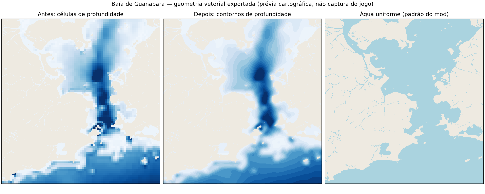

# Rio de Janeiro — Subway Builder

A map of Greater Rio covering Rio de Janeiro, the Baixada Fluminense, Niterói, São Gonçalo, Japeri and surrounding municipalities.

## Version 2.2.0

- RAIS 2024 CEP/activity counts and CNEFE 2022 addresses replace generic municipal workplace placement.
- Census age structure and municipal employment feed PNAD controls; informal activity shares now come from PNAD microdata.
- Enforced Census 2022 local containment and a documented historical 2010 destination prior replace global unconstrained destination choice.
- Both municipal OD and workplace totals remain exact after integer rounding; fine choices use directed road-time paths.
- 38 passenger, visitor and student destinations include Santos Dumont, UFF, universities, six hospitals, five beaches, four malls and both major stadiums.
- Smooth vector ocean depth bands preserve the original collision depths. Compatibility includes **Subway Builder 1.7.0 and 1.7.1**.

Census population stays **11,491,836**. Estimated employed residents are **5,519,167**;
**4,414,637** generate in-map work trips after home/external/multiple-workplace
exclusions. The release adds **314,835** non-work trip equivalents, totaling
**4,729,472 demand units**. These units are not unique census inhabitants.
There are **8,650 source demand points**, not tens of thousands.

[Methodology and sources](METHODOLOGY.md) · [Quality re-review dossier](QUALITY_REVIEW.md) ·
[Validation tables](reports/quality) · [Registry descriptions](REGISTRY_DESCRIPTION.md)

**[Passo a passo para publicar e pedir reavaliação](PUBLICAR_E_REAVALIAR.md)**

## Build

```sh
# Install Python dependencies. Full geometry generation also requires tippecanoe.
.venv/bin/pip install -r requirements.txt

# Fetch pinned official data and prepare reusable filtered intermediates.
.venv/bin/python -u fetch_quality_sources.py
.venv/bin/python -u prepare_quality_sources.py

# Upgrade existing census demand without rebuilding geography.
.venv/bin/python -u build_rio.py --quality-upgrade

# Full generation when geography itself needs rebuilding.
.venv/bin/python -u build_rio.py

# Recalibrate existing, current census anchors.
.venv/bin/python -u build_rio.py --employment-only

# Recreate the release and preview from already generated geography and workers.
.venv/bin/python -u build_rio.py --package-only
```

Output is always `dist/RIO.zip`; intermediate data is in `build/RIO/`. Do not run multiple generations simultaneously. A full generation can take a long time. The frozen RJ demographic aggregates and municipal census responses are committed under `sources/`; other cached sources are in `data/`.

The first rebuild from 2.0.0 must regenerate census demand because its old anchors contained duplicated sectors. The current build already includes that correction. `data/quality_baseline/` preserves the pre-upgrade census demand and metadata for repeatable upgrades. A full rebuild refreshes that baseline after regenerating census demand.

Packaging always rebuilds special demand from the worker-only intermediate. It writes `dist/special_demand_report.json` with exact conversions and `dist/registry_update.json` with the suggested tags. These two reports are supporting material, not required game assets.

## Validation

```sh
.venv/bin/python -m unittest discover
.venv/bin/python -u validate_rio.py
```

Validation checks census totals, unique sector allocations, commuter memberships, building index, map tiles, water data, exported special demand and ZIP integrity. It does not run an in-game simulation. `check_integration.py` checks the development server's API endpoints; that server serves intermediate data. `install_rio.py` now takes its demand from the release ZIP.

## Publish / fix the Railyard 1.7.1 compatibility message

Upload **both `dist/RIO.zip` and `dist/manifest.json` as separate assets** of release **`v2.2.0`**. The standalone manifest is copied from the root `manifest.json` on each packaging run.

The old release declared exactly `1.7.0`, which excludes `1.7.1`. The new range fixes that metadata restriction. It is supported by the [official 1.7.1 changelog](https://www.subwaybuilder.com/changelog), which lists a startup bug fix; no gameplay test is implied. Railyard's existing online listing will only see the correction after the new assets are published and its Registry/version metadata refreshes.

ZIP contents at the root:

```text
RIO.pmtiles
RIO_foundations.pmtiles
buildings_index.bin
config.json
demand_data.json
roads.geojson
runways_taxiways.geojson
ocean_depth_index.json.gz
```

For the Registry listing, request these tags: `airports`, `entertainment`, `ferries`, `hospitals`, `parks`, `schools`, `universities`.

[QUALITY_REVIEW.md](QUALITY_REVIEW.md) contains the re-review draft and conditional Medium/High scenarios. Special demand does not contribute to that score; only a maintainer can confirm a new quality tier. No Registry issue, release upload or remote publication is performed by these build commands.

## Water appearance

The coastline, islands, lakes and rivers retain their OpenStreetMap geometry. Optional depth shading now uses continuous 2 m depth bands from the GMRT raster, with one source-pixel Gaussian smoothing for display only. This avoids the former rectangular colored cells without claiming finer measured depths. The collision index remains unchanged.

The development and menu mods default to uniform water (`oceanFoundations: false`). For an existing save or a Railyard-only installation, turn off **Ocean foundations** in the game's layer controls for the flat-water appearance. Turning it on shows the new contour bands. Existing visibility preferences are not forcibly overwritten.


